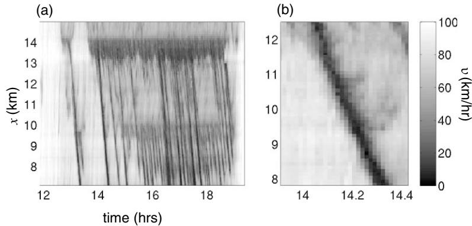
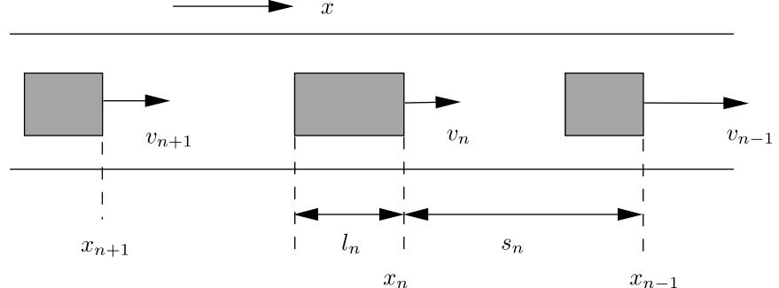
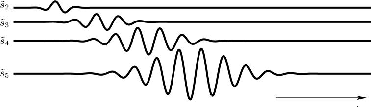
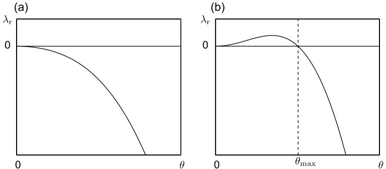
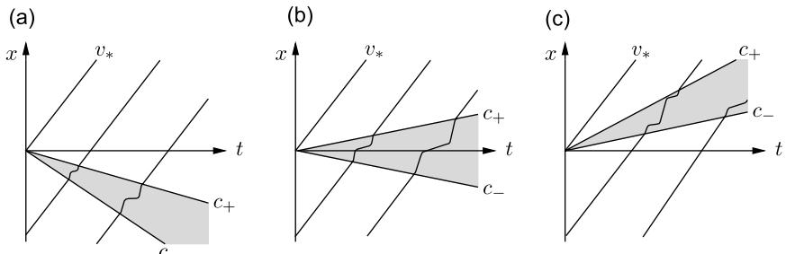
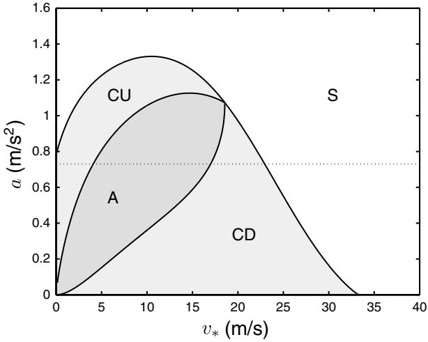

# Car-following models: fifty years of linear stability analysis a mathematical perspective

R.E. Wilsona \* and J.A. Wardb

a Department of Engineering Mathematics, University of Bristol, Bristol, UK; b Department of Mathematics, University of Limerick, Limerick, Republic of Ireland

(Received 17 March 2010; final version received 23 July 2010)

A general framework for car-following models is developed and its linear stability properties are analysed. The concepts of uniform flow, platoon stability and string stability are introduced and criteria which test for them are developed. Finally, string instability is divided into absolute, convective upstream and convective downstream sub-classes, and a procedure is developed to distinguish between them.

Keywords: highway traffic modelling; car-following models; linear stability

# 1. Introduction, motivation and historical perspective

Stop-and-go waves, in which traffic comes to a temporary halt for no apparent reason, are a familiar part of the motorway driving experience: see Figure 1. It is now broadly accepted that stop-and-go waves are caused by some kind of instability, and in fact this idea dates back to the pioneering days of car-following (CF) models in the 1950s and early 1960s (e.g. Pipes 1953, Kometani and Sasaki 1958, Herman et al. 1959, Gazis et al. 1961). Here 'CF model' shall mean broadly any model of highway traffic that describes the motion of individual vehicles in continuous space and time. The first fluid dynamical model (Lighthill and Whitham 1955) does not display instability, so in this sense the early CF models appeared to have a significant advantage.

In the intervening 50 years, with the advent of modern computing power, CF models have found widespread application in microsimulation software packages. Moreover, it has become fashionable for the models so used to become rather more complicated than their classical predecessors. See (for example) Brackstone and McDonald (1999) for a review. In parallel to the practical microsimulation effort, Mathematicians and Theoretical Physicists re-discovered CF models in the mid-1990s (beginning with Bando et al. 1995) and have found them to be a rich source of dynamical behaviour. See Helbing (2001) for a review. In recent years, this community has realised that nonlinear stability is the key to explaining wave features in highway traffic (e.g. Gasser et al. 2004, Orosz et al. 2004, Scho¨nhof and Helbing 2007) but in our view it will take some time for this know-how to become accessible to mainstream traffic engineers.

A serious drawback of the recent theoretical developments is that they have been applied to models which are over-simplified from the practical perspective. On the other hand, we may criticise the microsimulation community which has added

\*Corresponding author. Email: re.wilson@bristol.ac.uk

Figure 1. Spacetime plots for a typical Friday afternoon (11 January 2008) on the M42 Active Traffic Management section. The data shown is 1-minute average speed data from lane 2 of the north-bound carriageway, as captured by the MIDAS inductance loop system. Vehicles drive in the direction of increasing x, which is measured from J3A. Flow breaks down at x:14km, corresponding to the on-ramp of J6. A set of stop-and-go waves then develops which propagates upstream. Panel (b) zooms in to show the fine detail of a single stop-and-go wave.

complexity to CF models without sufficient data to parametrise the fine details and without a proper understanding of their qualitative effect. For example, the linear stability analysis of modern microsimulation models is usually considered 'too difficult', and so is not attempted. Our purpose is to put this right a process that the first author began with an analysis of Gipps's CF model nearly 10 years ago (Wilson 2001). Gipps's model is much more complicated than those usually considered in the theoretical literature, and has been used in several commercial microsimulation packages, for example the Highways Agency's in-house software SISTM. However, with some persistence, one may show that the linear stability calculation is tractable and moreover, that linear instability is not possible in Gipps's model in useful parameter regimes.

The chief obstacle to progress is that it is very complicated to re-work the details of linear stability calculations for each new CF model that we may wish to analyse. However, over the last few years we have realised that there is a common structure that lies behind the details of all of the linear stability calculations reported in the 50 years old literature on this topic. Thus we began work to abstract this structure and develop a general CF model framework which incorporates many (but not all) existing models. Using this framework, the first author derived (Wilson 2008) simple formulae which may be used to classify the linear stability of models within the framework in quite general terms. The task of the microsimulation practitioner is thus made simpler: he only need cast his model within the general framework, after which the stability tests require him to compute and manipulate just three partial derivatives. All other calculations are hid behind the scenes within the derivation of the formulae in Wilson (2008).

The purpose of this paper is thus to explain the general CF model framework to a wide audience of microsimulation practitioners. Moreover, we will provide an easyto-understand survey of the different types of linear stability, illustrated by simple pictures, and defined rigorously by mathematical criteria expressed in the general CF model framework. This is the meat of the paper, laid out in Sections 28. Because of the technical (but not mathematical) audience, we will sketch the development of the theory, but we will avoid cluttering the argument with proofs or details that are probably not of interest to this community.

Finally (Section 9), we will show that there is still some fresh ground in this muchstudied topic, and we will outline some recent work that was begun in the Ph.D. thesis of the second author (Ward 2009). As we shall see, the only reasonable form of linear instability is string instability in which an envelope of fluctuations grows as it travels up a column of traffic, but where each individual vehicle returns to equilibrium after the envelope has passed. However, because of the underlying (forward) vehicle motion, it is not possible to say a priori whether this envelope is confined to upstream propagation relative to the road, or whether it can also convect downstream (contrary to what empirical data suggests). In our view, this distinction is very important in model parametrisation and yet it has received very little attention in the literature. The basic ideas have already been introduced in qualitative terms (e.g. Treiber et al. 2000) and studied via simulations (Treiber et al. 2010) but a mathematical analysis is lacking. We thus outline asymptotic methods in order to develop criteria which distinguish between these convective and absolute instability types.

#### 2. General modelling framework

We follow the general CF model framework developed by Wilson (2008). Our starting point is the standard situation depicted in Figure 2. We consider a single lane of traffic with identical vehicles labelled 1,2, etc. in the upstream direction. Displacements and velocities are denoted xn(t) and vn(t) ]0, respectively, and we shall also use the front-to-front spacing sn(t):xn1(t)xn(t) 0 of consecutive vehicles, referred to as Dx by some authors. In practice, we are most interested in the clearance sn(t)ln1. However, the analytical framework precedes in much the same way whether we incorporate the preceding vehicle's length ln1 in the spacing variable or as a separate parameter.

Overtaking is neglected in our framework in return for analytical tractability. Our approach is to view lane-changes (and other imperfections, such as noise, heterogeneous road, differences between drivers, etc.) as external perturbations to a deterministic single lane model, the stability of which should then be analysed.

Figure 2. General car-following model set-up.

Our general form for CF models then consists of a set of coupled differential equations for the trajectory of each vehicle, which supplements the obvious kinematic relations

$$
\dot{\mathbf{x}}\_n = \mathbf{v}\_n,\tag{1}
$$

with a behavioural model

$$
\dot{\mathbf{v}}\_n = f\left(\mathbf{s}\_n, \Delta \mathbf{v}\_n, \mathbf{v}\_n\right), \tag{2}
$$

where dot denotes differentiation with respect to time, and we define the relative velocity by

$$
\Delta \mathbf{v}\_n := \dot{\mathbf{s}}\_n = \mathbf{v}\_{n-1} - \mathbf{v}\_n. \tag{3}
$$

Eq. (2) thus mimics how each driver accelerates or brakes in response to his own velocity and the relative motion of the preceding vehicle. Our programme is to derive results for models in the general form (2) with the minimum number of additional assumptions.

Finally, note in practice there are many possible refinements to Eq. (2) such as the inclusion of reaction-time delay, multi-anticipation (where the motion of more than one vehicle ahead is considered), lane-changing effects, and heterogeneity of the vehicle fleet and driver population but these are beyond the scope of the present discussion.

#### 3. Uniform flow solutions

Motivated by data, we focus on model (2) where there is an equilibrium speedspacing relation V. This is our first key model requirement:

Equilibria and Uniform Flow. We require that there is a function V (the equilibrium speed-spacing relationship) such that

$$f(\mathbf{s}\_\*, \mathbf{0}, V(\mathbf{s}\_\*)) = \mathbf{0} \quad \text{for all} \quad \mathbf{s}\_\* > \mathbf{0}. \tag{4}$$

It follows that there is a one-parameter family of steady driving solutions known as uniform flows, in which

$$\mathbf{x}\_n(t) = \mathbf{x}\_0 - \mathfrak{n}\mathbf{s}\_\* + t\mathcal{V}(\mathbf{s}\_\*). \tag{5}$$

Thus in a uniform flow solution, all vehicles drive at the same speed V(s\*) (so that the relative velocity of any pair of vehicles is zero) with the same time-independent spacing s\*. In the tx plane, vehicle trajectories are thus equally spaced parallel straight lines.

Note that in some models the function V is provided explicitly as a parameter, whereas in others, it is derived by isolating v\* from the relation f(s\*,0,v\*) -0. Whichever is the case, some sensible requirements are (1). V(s\*) ]0 for s\*]0 (all equilbria involve forward-driving vehicles); (2). V?(s\*) ]0 (vehicles tend to drive faster as their spacing increases); and (3). V(s)0Vmax as s0 (so there is a maximum equilibrium speed corresponding to something like the legal limit).

Finally, note that there is a natural connection between V and the fundamental diagram which relates flow Q and density r. To see this, observe that r -1/s, and thus Q(r) rV-(1/r).

#### 4. Linearisation about uniform flow

Our approach is to consider small perturbations to the uniform flow equilibria by setting

$$\mathbf{s}\_{n} = \mathbf{s}\_{\*} + \mathbf{\bar{s}}\_{n}(t) \quad \text{and} \quad \mathbf{v}\_{n} = V(\mathbf{s}\_{\*}) + \mathbf{\bar{v}}\_{n}(t), \tag{6}$$

where ~sn and ~vn are small. Assuming f is sufficiently smooth, this linearisation yields

$$
\dot{\tilde{\mathbf{v}}}\_{n} = f\_{s}\tilde{\mathbf{s}}\_{n} + f\_{\Delta r}\dot{\tilde{\mathbf{s}}}\_{n} + f\_{r}\tilde{\mathbf{v}}\_{n},\tag{7}
$$

where the partial derivatives fs, fDv and fv are evaluated at the equilibrium arguments (s\*,0,V(s\*)). Since €sn ¼ v\_ n1 v\_ n, and hence €~sn ¼ ~\_ vn1 ~\_ vn, we may apply the difference operator to Eq. (7) to obtain

$$
\ddot{\tilde{s}}\_{n} = f\_{s}(\tilde{s}\_{n-1} - \tilde{s}\_{n}) + f\_{\Delta v}(\dot{\tilde{s}}\_{n-1} - \dot{\tilde{s}}\_{n}) + f\_{v}(\tilde{v}\_{n-1} - \tilde{v}\_{n}).\tag{8}
$$

Since Eq. (3) implies ~\_ sn ¼ ~vn1 ~vn, velocity fluctuations may be eliminated and we may re-arrange to write

$$
\ddot{\tilde{s}}\_n + (f\_{\Delta v} - f\_v)\dot{\tilde{s}}\_n + f\_s \tilde{s}\_n = f\_{\Delta v} \dot{\tilde{s}}\_{n-1} + f\_s \tilde{s}\_{n-1},\tag{9}
$$

which is the key equation in this paper. Fundamentally, Eq. (9) describes the second order dynamics of vehicle n driven by those of its immediate predecessor n1.

Rational driving constraints. The partial derivatives of sensible CF models should satisfy

$$f\_x > 0, \ f\_{\Delta v} > 0 \quad \text{and} \ f\_y < 0. \tag{10}$$

Put simply: in a pair of situations in which all other aspects are equal, a larger spacing should result in more acceleration (or less braking); a larger (more positive) relative velocity should result in more acceleration (less braking) since the vehicle in front is leaving one behind; and the larger one's own velocity, the tendency to accelerate should be less (or the tendency to brake should be more). Strictly speaking, Eq. (10) should be relaxed to allow fs-0 and fDv-0 at large spacings, when driving is essentially independent of the vehicle ahead. However, the focus in stability calculations is in close-following situations, and hence we enforce strict inequality in what follows.

Conditions (10) should apply globally at all valid arguments of the acceleration function f, although for the purposes of this paper we are concerned only with their values at uniform flow arguments (s\*,0,V(s\*)). Constraints (10) may seem 'obvious' however, a number of popular CF models fail to satisfy them in some parameter regimes, with dire consequences for the resulting dynamics.

#### 5. Examples of car-following (CF) models

We now give some examples of established CF models and show how they fit within the framework presented so far.

# 5.1. Optimal Velocity with Relative Velocity (OVRV) model

See (for example) Ward (2009). This is a typical example of a simple model that is frequently analysed by the Mathematics and Theoretical Physics community. We have

$$f(\mathbf{s}\_n, \Delta \mathbf{v}\_n, \mathbf{v}\_n) = \mathfrak{a}(V(\mathbf{s}\_n) - \mathbf{v}\_n) + \mathfrak{B} \Delta \mathbf{v}\_n,\tag{11}$$

where V is the equilibrium speed-spacing (Optimal Velocity) function defining the maximum safe speed for a given spacing, which drivers relax towards at rate a 0. The term bDvn (b 0) models the tendency for drivers to brake when closing in on their predecessor, and to accelerate when the gap is increasing. The Optimal Velocity with Relative Velocity (OVRV) model is not intended to model quantitative details of driver behaviour, but rather to capture the correct qualitative features in the simplest possible functional form. When b -0, the OVRV model reduces to the much-studied Optimal Velocity model due to Bando et al. (1995).

To connect with the previous discussion, note that V(s) is a model parameter and so can be chosen to fit empirical data before dynamical effects are considered. The partial derivatives of interest are

$$f\_s = \mathfrak{a}V'(\mathfrak{s}\_\*), \ f\_{\Delta v} = \mathfrak{k} \quad \text{and} \ f\_r = -\mathfrak{a}.\tag{12}$$

# 5.2. Intelligent Driver Model (IDM)

See Treiber et al. (2000). We have

$$f(\mathbf{s}, \Delta \mathbf{v}, \mathbf{v}) = a \left[ 1 - \left( \frac{\mathbf{v}}{\nu\_0} \right)^{\delta} - \left( \frac{\hat{\mathbf{s}}(\mathbf{v}, \Delta \mathbf{v})}{\mathbf{s} - \mathbf{l}} \right)^2 \right],\tag{13}$$

where

$$\hat{s}(\mathbf{v}, \Delta \mathbf{v}) := \mathbf{s}\_0 + \mathbf{s}\_1 \sqrt{\frac{\mathbf{v}}{\mathbf{v}\_0}} + \tau \mathbf{v} - \frac{\mathbf{v} \Delta \mathbf{v}}{2 \sqrt{ab}},\tag{14}$$

and the notation and standard parameter values are given in (Table 1). In contrast to the OVRV model, the Intelligent Driver Model (IDM) is an attempt to model driver behaviour quantitatively in dimensional terms, and we may view Eqs. (13,14) as a proxy for the complicated schemes that one usually finds in commercial microsimulation packages.

Table 1. Standard dimensional parameter values for the IDM model. In common with Treiber et al. (2000), we set s1-0 m.

| Desired velocity      | v0 | 120 km/h (33.3 m/s) |
|-----------------------|----|---------------------|
| Safe time headway     | t  | 1.6 s               |
| Maximum acceleration  | a  | 0.73 m/s2           |
| Desired deceleration  | b  | 1.67 m/s2           |
| Acceleration exponent | d  | 4                   |
| Jam distance          | s0 | 2 m                 |
| Vehicle length        | l  | 5 m                 |

Note that in the IDM, the speed-spacing function is not provided explicitly. However, if we set vv\* and Dv-0, then Eq. (14) gives ^s in terms of v\*. On substitution in Eq. (13) with ss\* and f set equal to zero, we may isolate s\* to give a spacing-speed function, which may be inverted numerically if required. Likewise, the partial derivatives of f may be attacked with implicit differentiation and the chain rule, but a numerical procedure is simpler.

#### 6. Platoon stability

Let us return to the mathematical development. We now consider local stability as it is commonly referred to in the traffic literature. Actually, we dislike the use of the adjective 'local' in this setting, since from the mathematical point of view, it suggests a theory of small amplitude perturbations. In fact, all of the stability types that we develop in this paper are concerned with small amplitude perturbations, so we much prefer to use the term platoon stability, which in our view describes the property in question more concisely.

The basic idea is as follows. Consider a small (finite) platoon of vehicles driving on an open road with the speed of the leading vehicle fixed at v\* and with all of the following vehicles driving in equilibrium at the same speed, i.e. in uniform flow with identical spacings s\*-V1 (v\*) in the homogeneous case where the vehicles and drivers are identical. Let us now apply the 'hand of god' and instantaneously 'kick' the second vehicle out of equilibrium, for example, by applying a small speed increase or decrease. This perturbation will also force the third vehicle and then subsequently the fourth vehicle out of equilibrium (and so on), so that as time progresses, the speeds and spacings of all of the vehicles will fluctuate, with the exception of the lead vehicle that continues to drive forward at speed v\*.

If the CF model in question is platoon-stable at speed v\*, then the fluctuations will decay (exponentially) as time progresses, so that the original uniform flow situation is recovered. In contrast, we have platoon instability if the fluctuations are permanent, that is, if an instantaneous perturbation is sufficient to set-up persistent (for all time) oscillations in a finite platoon. At the linear level, platoon instability displays an exponential growth of solutions, but in any practical model, this growth must be checked by nonlinear terms so that speeds remain bounded and vehicles do not crash. (The reasoning is that crashes in the real-world are so rare that deterministic CF models should be configured so as to never produce them.)

To analyse platoon stability, it is sufficient to consider Eq. (9) which describes how fluctuations of the n-th vehicle's spacing are driven by its immediate predecessor, but we replace the right-hand side by a forcing function F(t) which represents the 'hand of god'. We then take the Laplace transform and re-arrange to obtain

$$\mathcal{S}\_n(z) = \frac{F(z)}{z^2 + (f\_{\Delta r} - f\_r)z + f\_s},\tag{15}$$

where Sn(z) and F(z) denote the Laplace transforms of ~snðtÞ and F(t), respectively, and we supply initial data ~sn;~\_ sn ¼ 0. On inversion, the growth or decay of the solution is governed by the poles l of the right-hand side which contribute terms of type exp(lt). If F(t) is instantaneous or exponentially decaying, then its poles are in the left-hand complex plane, so all interest focuses on the denominator. We thus obtain the main result, as follows.

Consider the quadratic equation:

$$
\lambda\_{\rm plat}^2 + (f\_{\Delta \mathbf{v}} - f\_{\mathbf{v}}) \lambda\_{\rm plat} + f\_{\mathbf{s}} = \mathbf{0}. \tag{16}
$$

- - If both solutions lplat have negative real parts, then the CF model is platoonstable for the uniform flow in question.
- - If either solution lplat has a positive real part, then the CF model is platoonunstable for the uniform flow in question.

Note that for CF models satistying the rational driving constraints (10), all coefficients in the quadratic Eq. (16) are positive, thus assuring platoon stability. Finally, note that the classification is always for a particular model, for particular parameters and for a given uniform flow. For any one model, the stability type may be different for uniform flows of different speeds, as indeed it may be for all the stability types discussed in this paper.

# 7. String stability

As we have seen, platoon instability is a very strong type of instability, and arguably we should design CF models so that it is avoided. Furthermore, platoon-stable CF models can display an alternative type of instability, known as string instability, which gives rise to structures resembling stop-and-go waves.

To define string instability, let us depart from reality for a moment and consider a notional semi-infinite column of vehicles n-1,2,... whose set-up is analogous to that of the finite platoon considered in Section 6: namely, the leader n-1 is given a fixed speed v\* and each of the following vehicles n-2,3,... is initially given the same speed v\* and equilibrium spacing s\*-V1 (v\*). As before, we apply the 'hand of god' and 'kick' the n-2 vehicle out of equilibrium. We thus set in place a chain of events in which the n-3,4,... vehicles are each subsequently disturbed from equilibrium and fluctuate.

If the given set-up is platoon-stable, then it follows that each individual vehicle will eventually return to equilbrium with sn0s\* and vn0v\*. However, in string instability, the fluctuations grow in the sense of their maximum deflection as we pass further and further up the chain of vehicles this effect is illustrated in Figure 3. In a finite platoon that is platoon-stable but string-unstable, fluctuations grow up the chain of vehicles until they are convected out of the platoon upon reaching the last vehicle.

The question of whether fluctuations are deemed to grow or decay thus depends on the frame of the observer in platoon stability, the frame is fixed on individual vehicles, whereas in string stability, the frame is permitted to move upstream relative to the column.

Of course, in reality there is no such thing as an infinite chain of vehicles. However, in practice a chain of perhaps 10s or 100s of vehicles will propagate sufficient growth to trigger nonlinear effects, outside the scope of the present discussion, which then dominate the consequent wave propagation.

Figure 3. A schematic illustration of string instability, showing the fluctuations in spacing of the 2nd, 3rd, 4th and 5th vehicles in our notional experiment. (Plots have been translated vertically for clarity.) Each vehicle returns to equilibrium (zero fluctuation) after sufficient time has passed. However, the fluctuation of each successive vehicle is greater than that preceding it, both in duration and in amplitude.

#### 8. String stability: ring-road analysis

How should we analyse string stability? The technical difficulty is to capture the semi-infinite column of vehicles, and the direct approach to this is to 'chain together' the Laplace transform calculation introduced in Section 6. However, the consequent Laplace inversion problem requires a subtle piece of asymptotic analysis that we have only recently solved this calculation is postponed to Section 9.

A simpler alternative procedure is to place a (large) finite number N of vehicles on a ring-road of length Ns\*, so that vehicle n-1, rather than having fixed speed v\*, obeys the CF model with vehicle n-N as its immediate predecessor. In this setting, string instability does not escape the finite scope of the experiment, since a fluctuation that grows as it travels upstream will pass entirely around the ring. In this fashion, if the set-up is string-unstable, each vehicle will display non-trivial t0 behaviour (even if the set-up is platoon-stable).

We must now construct an ansatz to Eq. (9) which respects the periodicity of the ring-road. Namely, if we count N vehicles around the road, we must return to where we started i.e. snNsn. Our approach is thus to decompose the solution of Eq. (9) into Fourier modes of the form

$$
\tilde{s}\_n = \mathbf{R} \mathbf{c} \left( A \mathbf{e}^{\mathrm{i}n 0} \mathbf{e}^{\mathrm{i}\iota} \right), \tag{17}
$$

where Re denotes real part, A is a complex constant (independent of n and t), and u -2pk/N is a discrete wave-number, where it suffices to consider k-1,2, ... [N/2], where [ ] denotes integer part. Since our interest is in large values of N, we shall typically consider the continuous range 0 Bu Bp. Here a small (positive) value of u corresponds to very long wavelength fluctuations, and u p gives the shortest possible wavelength in this discrete setting, i.e. a mode that is period-two in the vehicle index.

This procedure may seem exotic: in fact, it is merely the separation of variables technique that is commonly taught to second year undergraduate engineers, for example, in the solution of heat conduction problems. The goal here is the same: to solve for the growth rate l in terms of the wave-number u. Substitution of Eq. (17) in Eq. (9) yields

$$
\lambda^2 + \left\{ f\_{\Lambda r} (1 - \mathbf{e}^{-i\theta}) - f\_r \right\} \lambda + f\_s (1 - \mathbf{e}^{-i\theta}) = 0. \tag{18}
$$

For a fixed u, Eq. (18) may be solved using the standard formula for the solution of a quadratic, to yield a pair of complex (non-conjugate) solutions. Our interest is then in the solution with the greatest (i.e. most positive, or least negative) real part, which we denote l(u). If we define lr(u):-Re(l(u)), then the sign of lr(u) governs the growth/decay of the given mode in the usual way that is, lr(u) B0 signifies decay, and lr(u) 0 signifies growth.

The problem is that in practice, a perturbation may consist of a linear combination of many modes of type (17). Therefore we need to analyse the behaviour of lr(u) as u varies. This may be achieved numerically: for example, see Figure 4. In fact, it may be p ¯ roven (Wilson 2008) that if the set-up satisfies rational driving constraints (10), then Figure 4 captures the only two possible qualitative situations. Either a set-up is stable in that lr(u) B0 for 0 Bu 5p, or if unstable, there is a window 0 Bu Bumax for which lr(u) 0, corresponding to small wave-number (long wavelength) modes that grow. In particular, short wavelength modes are always attenuated.

It may then be shown that the geometry of lr(u) at u -0 determines which stability type occurs. To this end, we may compute a power series solution of Eq. (18) in the form

$$\lambda\_+(\theta) = i\lambda\_1\theta + \lambda\_2\theta^2 + i\lambda\_3\theta^3 + \lambda\_4\theta^4 + \dots,\tag{19}$$

where l1, l2,..., etc. are real coefficients. On equating powers, we first find l1fs /fv . However, the curvature l2 gives our main result.

Consider a given uniform flow and a CF model which obeys the rational driving constraints (10). Compute the quantity:

$$
\lambda\_2 := \frac{f\_s}{f\_v^3} \left(\frac{f\_v^2}{2} - f\_{\Lambda v} f\_v - f\_s\right). \tag{20}
$$

Then

- -If l2B0, the CF-model is string-stable for the uniform flow in question.
- -If l20, the CF-model is string-unstable for the uniform flow in question.

In contrast to platoon instability, string instability is a desirable property for the congested (slow) uniform flow solutions of a CF model, since it tends to give rise naturally to stop-and-go waves, and so represents an important feature of reality.

Figure 4. Plots of the growth rate lr as a function of u: (a) string-stable; (b) string-unstable. The transition to instability is given by a change in the sign of the second derivative l2 at u -0.

#### 9. Convective versus absolute string stability

So far, the aim has been to give an accessible account of recent work (Wilson 2008) in linear stability and to put simple criteria and tests at the disposal of the microsimulation community. We now move on to a topic at the cutting edge of our research. To this end, let us focus on a deeper analysis of string instability. When a 'kick' is applied to a semi-infinite column of vehicles, the resulting fluctuations propagate upstream relative to the column. This is a necessary consequence of Eq. (9) and the way in which the general CF model has been put together: the coupling of vehicles is unidirectional in that each vehicle's dynamics are forced by those of its predecessor, and not by those of its successor. Hence 'information' can only propagate upstream relative to the vehicles. However, the vehicles themselves are driving forward with respect to the frame of the road. Hence it is not clear whether fluctuations propagate upstream or downstream relative to the road once the vehicles' absolute motion is considered.

The direction of fluctuations in terms of absolute space has been previously studied in both CF and macroscopic simulations (Treiber et al. 2010), but, with the exception of a single paper based on group velocity calculations for one particular CF model (Mitarai and Nakanishi 2000), a mathematical analysis has so-far been lacking.

The possible scenarios are illustrated in Figure 5. We shall see that in the frame of the road, the fluctuations from an instantaneous 'kick' spread out in a triangular 'wedge' whose up- and downstream edges have velocities c and c, respectively. There are then three possible classes of behaviour:

- - Convectively upstream (string) instability (type CU), where cBcB0. See Figure 5a. Fluctuations propagate only upstream in the tx plane.
- - Absolute (string) instability (type A), where cB0 Bc. See Figure 5b. Fluctuations spread out to cover the whole tx plane.
- - Convectively downstream (string) instability (type CD), where 0 BcBc. See Figure 5c. Fluctations propagate only downstream in the tx plane.

Figure 5. The propagation of an instantaneous disturbance to a string-unstable uniform flow of speed n\*, as observed in the frame of the road. The 'wedges' of instability are shaded in grey and bounded up- and downstream by velocities c and c, respectively. (a) Convectively upstream instability (type CU) the desirable kind; (b) absolute instability (type A); (c) convectively downstream instability (type CD).

As we can see from plots such as (Figure 1), the patterns that emerge from congested motorway merges propagate only in an upstream direction. This fact could be due to nonlinear effects but it suggests that CF models should be parametrised so that if they are linearly string-unstable, then only type CU occurs.

The question then is of how to classify the type of string instability. Unfortunately, the ring-road analysis is no longer sufficient and we need to return to the notional semi-infinite column of vehicles and the instantaneous 'kick'. The first trick is to take the Laplace transform of Eq. (9), to yield

$$(z^2 + (f\_{\Lambda r} - f\_r)z + f\_s) \mathcal{S}\_n(z) = (f\_{\Lambda r} z + f\_s) \mathcal{S}\_{n-1}(z),\tag{21}$$

where Sn1(z) and Sn(z) denote the Laplace transforms of ~sn1ðtÞ and ~snðtÞ, respectively, and we consider locations upstream of the initial disturbance so that ~sn1;~\_ sn1 ¼ 0 and ~sn;~\_ sn ¼ 0. The next insight is to observe that Eq. (21) is a recursion relation which may be solved in the form

$$S\_n(z) = \mathbf{g}(z)"{F}(z),\tag{22}$$

with

$$\log(z) := \frac{f\_{\Lambda v}z + f\_s}{z^2 + (f\_{\Lambda v} - f\_v)z + f\_s},\tag{23}$$

where as before, F(z) denotes the Laplace transform of the initial forcing. The technical difficulty is now in the inversion of Eq. (22), which can be solved in closed form by computing residues, but the result is extremely complicated and not especially useful. This is because the poles of the integrand (namely the platoon 'eigenvalues' lplat) are degree n, and so the residue calculation involves the (n1) differential of the regular part of the integral, and consequently iterative applications of the Leibnitz rule.

The correct (and novel) approach is to apply asymptotic methods. Specifically, we use the method of steepest descentsto extract the t0 solution behaviour: see (for example) Bender and Orszag (1999) for details. The general scope of the method is the integral

$$I = \int\_{C} h(z) \exp(t\rho(z)) dz,\tag{24}$$

where h(z) and r(z) are analytic except at isolated singularities (poles, branch cuts, etc.). The idea is then to consider an alternative contour C? which is obtained by deforming C. If this can be achieved without crossing the integrand's singularities, then I is unchanged by Cauchy's theorem. We seek such a C? that passes through a saddle point z\* at which r?(z\*) -0, and at which the local and global maxima of Re(r(z)) is attained along the contour. In consequence, as t0, the local properties of the integrand at the saddle point dominate the integral, and the leading order asymptotics may be computed in the form

$$I \sim \left(\sqrt{\frac{2\pi}{t|\rho^\*(z\_\*)|}}\right) h(z\_\*) \exp(t \text{Re}\rho(z\_\*)) \exp(\mathrm{i}(\zeta + t \text{Im}(\rho(z\_\*)))),\tag{25}$$

where z arg rƒ(z\*)/2p/2.

The main trick is then to re-arrange the Laplace inversion integrand so that there is a saddle point. We write

$$\mathbf{g}(z)''F(z)\mathbf{e}^{\ell z} = F(z)\exp(tz + \eta \log \mathbf{g}(z)),\tag{26}$$

so that we may proceed with hðzÞ ¼ FðzÞ and

$$\mathfrak{p}(z) = z + \kappa \log \mathfrak{g}(z),\tag{27}$$

where k n/t. For the method of steepest descents to work, we require r(z) and f(z) to be independent of t, so we fix k while we apply the t0 asymptotics. In essence, we thus analyse wave propagation along a ray with 'speed' k upstream in the lattice frame. The saddle points are then found by computing

$$\rho'(z) = 1 + \kappa \frac{\mathbf{g'}(z)}{\mathbf{g}(z)},\tag{28}$$

and thus we seek solutions of

$$\text{sg}(z) + \text{sg}^{'}(z) = 0,\tag{29}$$

yielding the (rather complicated!) cubic equation

$$f\_{\Lambda r}z^3 + [f\_s + f\_{\Lambda r}(f\_{\Lambda r} - f\_r) - f\_{\Lambda r}\kappa]z^2 + [f\_s f\_{\Lambda r} + f\_s(f\_{\Lambda r} - f\_r) - 2f\_s\kappa]z + f\_s^2 + f\_s f\_r\kappa = 0,\tag{30}$$

parametrised by k. In general, Eq. (30) must be solved numerically. The question is then for a given k, which of the three roots of Eq. (30) should be taken as z\* in formula (25). The details of this selection are beyond the present discussion and the full procedure is developed in a working paper (Ward and Wilson 2010).

However, once the correct saddle z\*(k) has been selected, formula (25) may be used to extract the t0 asymptotics. However, more importantly, we may extract the exponential growth factor

$$\phi(\kappa) := \operatorname{Re}\rho(z\_\*) = \operatorname{Re}(z\_\*) + \kappa \log|\mathbf{g}(z\_\*)|. \tag{31}$$

which dominates as t0. If f(k) 0, then perturbations grow along the ray in question, whereas if f(k) B0, they decay. The final task is then to consider how f depends on k. In summary, in a string-unstable situation, we find k1, k20 so that f(k) 0 for k1Bk Bk2, and f(k) B0 elsewhere. Thus k1 and k2 identify critical speeds bounding the wedge in which perturbations can grow, and we may calculate the so-called signal velocities,

$$\mathbf{c}\_{-} := \mathbf{v}\_{\*} - \kappa\_{2}\mathbf{s}\_{\*},\tag{32}$$

and

$$\mathbf{c}\_{+} := \mathbf{v}\_{\*} - \kappa\_{1}\mathbf{s}\_{\*},\tag{33}$$

measured relative to absolute space, which bound the wedge in which perturbations grow in this set-up. The finer classification of string instability then proceeds using the signs of c and c, as shown in Figure 5.

To summarise what may be achieved, consult Figure 6 which applies these procedures to classify string instability for the IDM model. The stability type of a range of uniform flows is calculated as the acceleration parameter a is varied. In

Figure 6. Classification of the stability regions for the IDM model, with standard parameters chosen from (Table 1) but with varying sensitivity parameter a. We consider the stability of uniform flows parametrised by the equilibrium velocity v\*. Here S denotes stability, A denotes absolute instability and CU and CD denote, respectively, convectively upstream and convectively downstream instability. The horizontal dotted line at a-0.73 m/s2 marks the standard value of this parameter for which both type A and type CD instability are possible. Our analysis suggests that a larger value of a should be used for which only CU instability is attained.

summary, this analysis establishes that the standard set of parameters is not appropriate and a larger value of a should be used.

#### 10. Conclusions

The bulk of our discussion has been concerned with the general CF model framework developed in Section 2, and the development and provision of formulae which may be used to classify the linear stability of CF models that belong to this framework. The intended audience is the microsimulation community and our hope is that this paper will stimulate a new wave of activity in the analysis of practical CF models as used in commercial packages.

Our view is that there are probably too many microsimulation models in circulation. (It has become fashionable for every researcher to derive his own model, perhaps because this leads to more publications!) The tools provided here may enable us to focus common attention on a small set of models that are proven to have good qualitative properties. This is because our tools can be used to reduce large families of models that can be shown to have essentially the same qualitative properties, or to eliminate models that are demonstrably poor.

To clarify, we propose the following programme of work which should be applied to each CF model:

- If possible, express the model in terms of the general framework described in Section 2. If an exact fit is impossible, look for approximations or limiting cases that fit the framework.

- - Identify the uniform flow solutions, as defined in Section 3. If this cannot be done in closed form, then resort to numerical tools.
- - Compute the three key partial derivatives described in Section 4. If this cannot be done in closed form, then resort to numerical tools.
- -Ensure the model is platoon-stable (Section 6).
- - Finally, test string stability across the full family of uniform flows and for a representative set of model parameters (Section 8). This step will almost certainly require numerical methods.

Note that this programme of qualitative classification is no substitute for the detailed parametrisation of the model with trajectory data, which should follow this programme once it has been established that the model is qualitatively ok.

Finally, we acknowledge that our framework is in need of further development so as to encompass models which presently do not fit within it. In this respect, the most serious shortcoming is the absence of reaction time although in fact the key test concerning long wavelength string instability is easily adapted to such delay equation models. All other refinements remain for future work.

### Acknowledgements

REW acknowledges the support of an EPSRC Advanced Research Fellowship (grant ref. EP/ E055567/1) and thanks the Highways Agency for access to MIDAS inductance loop data. JAW acknowledges the support of the Science Foundation Ireland (grant ref. 06/MI/005). We also thank Martin Treiber for bringing the convective stability idea to our attention at a meeting in Hamburg in 2007, and for subsequent discussions (Vienna, May 2008 and Dresden, April 2009).

#### References

- Bando, M., et al., 1995. Dynamical model of traffic congestion and numerical simulation. Physical Review E, 51, 10351042.
- Bender, C.M. and Orszag, S.A., 1999. Advanced mathematical methods for scientists and engineers. Berlin: Springer-Verlag.
- Brackstone, M. and McDonald, M., 1999. Car following: a historical review. Transportation Research F, 12, 181196.
- Gasser, I., Sirito, G., and Werner, B., 2004. Bifurcation analysis of a class of car-following traffic models. Physica D, 197, 277296.
- Gazis, D.C., Herman, R., and Rothery, R.W., 1961. Nonlinear follow-the-leader models of traffic flow. Operations Research, 9, 545567.
- Helbing, D., 2001. Traffic and related self-driven many-particle systems. Reviews of Modern Physics, 73, 10671141.
- Herman, R., et al., 1959. Traffic dynamics: analysis of stability in car-following. Operations Research, 7, 86106.
- Kometani, E. and Sasaki, T., 1958. On the stability of traffic flow. Journal of Operations Research Japan, 2, 1126.
- Lighthill, M.J. and Whitham, G.B., 1955. On kinematic waves. II: a theory of traffic on long crowded roads. Proceedings of the Royal Society Part A, 229, 317345.
- Mitarai, N. and Nakanishi, H., 2000. Convective instability and structure formation in traffic flow. Journal of the Physical Society of Japan, 69, 37523761.
- Orosz, G., Wilson, R.E., and Krauskopf, B., 2004. Global bifurcation investigation of an optimal velocity traffic model with driver reaction time. Physical Review E, 70, Art no. 026207.
- Pipes, L., 1953. An operational analysis of traffic dynamics. Journal of Applied Physics, 24, 274281.
- Scho¨nhof, M. and Helbing, D., 2007. Empirical features of congested traffic states and their implications for traffic modelling. Transportation Science, 41, 135166.
- Treiber, M., Hennecke, A., and Helbing, D., 2000. Congested traffic states in empirical observations and microscopic simulations. Physical Review E, 62, 18051824.
- Treiber, M., Kesting, A., and Helbing, D., 2010. Three-phase traffic theory and two-phase models with a fundamental diagram in the light of empirical stylized facts. Transportation Research B, 44, 9831000.
- Ward, J.A., 2009. Heterogeneity, lane-changing and instability in traffic: a mathematical approach. Thesis (PhD). University of Bristol.
- Ward, J.A. and Wilson, R.E., 2010. Criteria for convective versus absolute string instability in car-following models. Bristol: Department of Engineering Mathematics, University of Bristol.
- Wilson, R.E., 2001. An analysis of Gipps's car-following model of highway traffic. IMA Journal of Applied Mathematics, 66, 509537.
- Wilson, R.E., 2008. Mechanisms for spatiotemporal pattern formation in highway traffic models. Philosophical Transactions of the Royal Society Part A, 366, 20172032.

Copyright of Transportation Planning & Technology is the property of Routledge and its content may not be copied or emailed to multiple sites or posted to a listserv without the copyright holder's express written permission. However, users may print, download, or email articles for individual use.